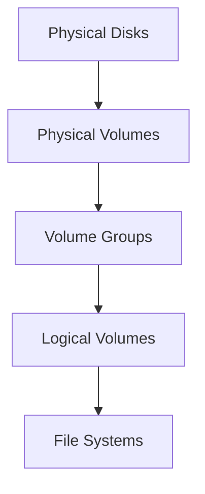
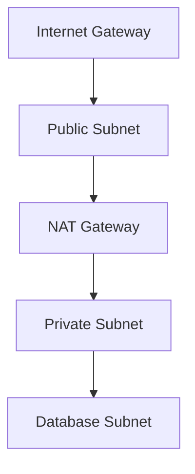
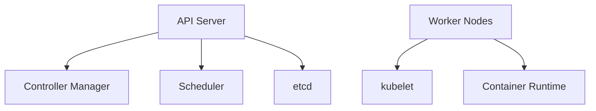

# 📚 클라우드 인프라스트럭처 Study Notes
## 📋 목차
1. [인프라 기초](#인프라-기초)
   - Windows Server
   - Linux 시스템
2. [스토리지 관리](#스토리지-관리)
   - 스토리지 유형
   - RAID 구성
3. [클라우드 아키텍처](#클라우드-아키텍처)
   - 서비스 모델
   - 네트워크 구성
4. [컨테이너 및 오케스트레이션](#컨테이너-및-오케스트레이션)
   - 쿠버네티스 구성
   - 서비스 관리
5. [클라우드 서비스 운영](#클라우드-서비스-운영)
   - 모니터링
   - 장애 대응
   
---

## 💻 인프라 기초
> 서버 운영의 기본이 되는 Windows와 Linux 시스템 관리

### Windows Server 핵심 기능
| 기능 | 설명 | 활용 사례 |
|------|------|-----------|
| Active Directory | 사용자/리소스 관리 | 계정/권한 통합관리 |
| Group Policy | 정책 일괄 적용 | 보안 설정 자동화 |
| IIS | 웹 서버 | 웹 애플리케이션 호스팅 |

### 시스템 초기화 도구
| 구분 | Initialization Tool | Sysprep |
|------|-------------------|----------|
| 주요 목적 | SID 초기화 특화 | 시스템 전체 초기화 |
| 활용 사례 | SQL Server 준비 | OS 배포 준비 |
| 처리 범위 | 제한적 초기화 | 전체 시스템 |
| 소요 시간 | 빠름(수분) | 느림(수십분) |

### Linux LVM 구성


### Linux 시스템 관리 핵심 명령어
| 카테고리 | 명령어 | 용도 | 예시 |
|---------|--------|------|------|
| 디스크 관리 | df, du | 디스크 사용량 확인 | df -h |
| 프로세스 | ps, top | 프로세스 모니터링 | ps aux |
| 네트워크 | netstat, ss | 네트워크 연결 확인 | netstat -antp |
| 패키지 | yum, apt | 패키지 관리 | yum install |

---

## 💾 스토리지 관리
> 데이터 저장과 관리를 위한 스토리지 시스템 구성

### 스토리지 유형별 특징
| 유형 | 접근 방식 | 주요 특징 | 적합한 워크로드 |
|------|-----------|-----------|----------------|
| Block Storage | 블록 레벨 | 고성능, 낮은 지연시간 | 데이터베이스 |
| Object Storage | HTTP/REST | 무제한 확장, 저비용 | 정적 파일, 백업 |
| File Storage | 파일 레벨 | 공유 가능, NFS/SMB | 공유 파일서버 |

### RAID 구성 상세
| RAID 레벨 | 구성 | 보호 수준 | 성능 | 공간 효율 | 권장 용도 |
|-----------|------|-----------|------|------------|-----------|
| RAID 0 | Striping | 없음 | ⚡⚡⚡ | 100% | 임시 데이터 |
| RAID 1 | Mirroring | 높음 | ⚡⚡ | 50% | 중요 시스템 디스크 |
| RAID 5 | Stripe + Parity | 중간 | ⚡⚡ | 67-94% | 범용 서버 |
| RAID 6 | Stripe + Dual Parity | 높음 | ⚡ | 50-88% | 대용량 저장소 |
| RAID 10 | Mirror + Stripe | 매우 높음 | ⚡⚡⚡ | 50% | 데이터베이스 |

### 스토리지 성능 지표
| 지표 | 설명 | 목표값 | 최적화 방안 |
|------|------|--------|------------|
| IOPS | 초당 I/O 작업 수 | >10,000 | RAID/SSD 사용 |
| Throughput | 처리량(MB/s) | >100MB/s | 네트워크 최적화 |
| Latency | 응답 시간 | <10ms | 캐시 layer 추가 |

---

## ☁️ 클라우드 아키텍처
> 클라우드 네이티브 환경 구성과 운영

### 서비스 모델 비교
| 모델 | 제어 범위 | 관리 책임 | 활용 사례 |
|------|-----------|-----------|-----------|
| IaaS | OS부터 상위 계층 | 인프라 자동화 | 클라우드 마이그레이션 |
| PaaS | 애플리케이션 | 개발 환경 | 웹 애플리케이션 개발 |
| SaaS | 설정과 데이터 | 서비스 이용 | 업무용 소프트웨어 |
| FaaS | 함수 코드 | 이벤트 중심 개발 | 마이크로서비스 |

### VPC 네트워크 구성


### 보안 구성 요소
| 구성 요소 | 목적 | 주요 설정 |
|-----------|------|-----------|
| Security Group | 인스턴스 레벨 방화벽 | 포트, 프로토콜 |
| NACL | 서브넷 레벨 방화벽 | IP 기반 규칙 |
| IAM | 접근 제어 | 역할, 정책 |
| WAF | 웹 공격 방어 | SQL injection, XSS |

### 고가용성 설계
| 구성 | 목적 | 구현 방식 |
|------|------|-----------|
| Multi-AZ | 가용성 향상 | 여러 AZ에 복제 |
| Auto Scaling | 부하 대응 | 자동 확장/축소 |
| Load Balancer | 부하 분산 | Round Robin, Least Connection |

---

## 🎯 컨테이너 및 오케스트레이션
> 컨테이너 기반 애플리케이션 운영

### 쿠버네티스 아키텍처


### 노드 유형별 특징
| 구분 | Master Node | Worker Node |
|------|-------------|-------------|
| 주요 기능 | 클러스터 관리 | 워크로드 실행 |
| 핵심 요소 | API Server, Scheduler | Kubelet, Container Runtime |
| 최소 사양 | 2CPU, 4GB RAM | 1CPU, 2GB RAM |

### 쿠버네티스 리소스
| 리소스 | 설명 | 사용 사례 |
|--------|------|-----------|
| Pod | 최소 실행 단위 | 애플리케이션 컨테이너 |
| Service | 네트워크 추상화 | 로드밸런싱, 서비스 디스커버리 |
| Deployment | 배포 관리 | 무중단 업데이트 |
| StatefulSet | 상태 유지 | 데이터베이스 |

---

## 🔧 클라우드 서비스 운영
> 안정적인 클라우드 서비스 운영을 위한 관리 방안

### 모니터링 구성
| 영역 | 모니터링 항목 | 임계치 | 대응 방안 |
|------|--------------|---------|-----------|
| 시스템 | CPU, Memory | 80% | Scale Out |
| 네트워크 | 트래픽, 지연 | 70% BW | 대역폭 확장 |
| 애플리케이션 | 응답시간, 오류율 | 99.9% | 성능 최적화 |

### 장애 대응 프로세스


### 운영 관리 체크리스트
- [ ] 자동화 구성
  ```
  - CI/CD 파이프라인
  - 인프라 프로비저닝
  - 백업/복구 자동화
  ```
- [ ] 보안 관리
  ```
  - 취약점 스캔
  - 접근 제어
  - 암호화 적용
  ```
- [ ] 비용 최적화
  ```
  - 리소스 모니터링
  - 예약 인스턴스 활용
  - 미사용 리소스 정리
  ```

### 관리형 서비스 활용
| 서비스 유형 | AWS | GCP | Azure | NCP |
|------------|-----|-----|-------|-----|
| 컨테이너 | EKS | GKE | AKS | NKS |
| 데이터베이스 | RDS | Cloud SQL | Azure DB | Cloud DB |
| 모니터링 | CloudWatch | Stackdriver | Monitor | Cloud Insight |
