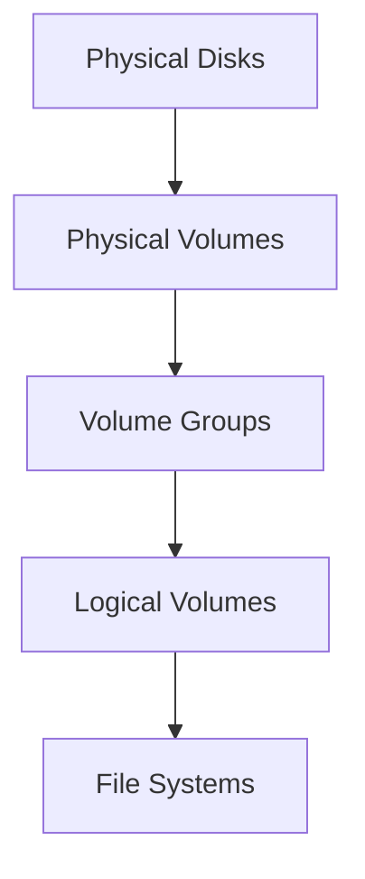

# 📚 클라우드 인프라스트럭처 완벽 가이드

## 📋 목차
1. [Windows Server 관리](#windows-server-관리)
2. [Linux 시스템 관리](#linux-시스템-관리)
3. [네트워크 스토리지](#네트워크-스토리지)
4. [클라우드 인프라](#클라우드-인프라)
5. [쿠버네티스 아키텍처](#쿠버네티스-아키텍처)
6. [네이버 클라우드](#네이버-클라우드)

---
## 🪟 Windows Server 관리
> 서버 관리의 기초와 초기화 도구에 대해 알기

### Initialization Tool 비교
| 기능 | Initialization Tool | Sysprep |
|------|-------------------|----------|
| 주요 목적 | SID 초기화 특화 | 시스템 전체 초기화 |
| 활용 사례 | SQL Server 준비 | OS 배포 준비 |
| 처리 범위 | 제한적 초기화 | 전체 시스템 |
| 소요 시간 | 빠름 | 상대적으로 느림 |

### 초기화 프로세스

📝 실행 체크리스트
* 관리자 권한 확보
* 시스템 백업 완료
* 네트워크 설정 확인
* SQL Server 상태 점검
* 초기화 도구 버전 확인

## 🐧 Linux 시스템 관리
> LVM을 통한 효율적인 스토리지 관리 방법 알기

### LVM 아키텍처

### LVM 구성 요소 비교
| 구성 요소 | 설명 | 관리 명령어 | 주요 특징 |
|----------|------|------------|-----------|
| Physical Volume | 물리 디스크/파티션 | pvcreate, pvremove | 기본 저장 단위 |
| Volume Group | PV의 집합 | vgcreate, vgextend | 저장소 풀 |
| Logical Volume | 실제 사용 볼륨 | lvcreate, lvextend | 파일시스템 생성 |

### 파티션 유형 가이드
| 코드 | 용도 | 특징 | 활용 |
|------|------|------|------|
| 83 | Linux | 일반 파티션 | 기본 시스템 |
| e6 | RAID | 중복성 제공 | 데이터 보호 |
| 8e | LVM | 유연한 관리 | 동적 확장 |

### 📝 LVM 구성 체크리스트
- [ ] 디스크 파티션 생성
- [ ] PV 초기화 확인
- [ ] VG 구성 계획
- [ ] LV 크기 설정
- [ ] 파일시스템 선택

---
## 💾 네트워크 스토리지
> 다양한 스토리지 솔루션의 특징과 활용 방안을 이해하기

### 스토리지 유형 비교
| 특성 | NAS | DAS | SAN |
|------|-----|-----|-----|
| 접근 방식 | 파일 레벨 | 블록 레벨 | 블록 레벨 |
| 연결 구성 | TCP/IP | 직접 연결 | FC/iSCSI |
| 확장성 | 높음 | 제한적 | 매우 높음 |
| 구축 비용 | 중간 | 낮음 | 높음 |
| 성능 | 보통 | 좋음 | 매우 좋음 |

### 성능 최적화 요소
| 항목 | 설명 | 모니터링 지표 |
|------|------|--------------|
| IOPS | 초당 I/O 처리량 | 읽기/쓰기 횟수 |
| 대역폭 | 데이터 전송량 | MB/s |
| 지연시간 | 응답 소요시간 | ms |

### 📝 스토리지 구성 체크리스트
- [ ] 용량 산정
- [ ] RAID 레벨 선택
- [ ] 네트워크 대역폭 확인
- [ ] 백업 정책 수립
- [ ] 모니터링 구성

---
## ☁️ 클라우드 인프라
> 클라우드 환경의 핵심 구성요소와 관리 방안 알기

### VPC 구성요소 비교
| 구성요소 | Zone 종속성 | 주요 기능 | 고가용성 |
|---------|------------|-----------|----------|
| VM | O | 컴퓨팅 | 단일 Zone |
| 로드밸런서 | X | 부하분산 | 다중 Zone |
| 서브넷 | O | 네트워크 분할 | 단일 Zone |
| NAT Gateway | O | 외부 연결 | 단일 Zone |

### 클라우드 서비스별 특징
| 서비스 | AWS | GCP | Azure | NCP |
|--------|-----|-----|-------|-----|
| 컴퓨트 | EC2 | GCE | VM | Server |
| 로드밸런서 | ELB | GLB | ALB | LB |
| VPC | VPC | VPC | VNet | VPC |

### 📝 클라우드 구성 체크리스트
- [ ] VPC CIDR 설계
- [ ] 가용영역 선택
- [ ] 서브넷 구성
- [ ] 보안그룹 설정
- [ ] 라우팅 테이블 구성

---
## 🎯 쿠버네티스 아키텍처
> 쿠버네티스 클러스터의 구성과 관리 방안 이해하기

### 노드 구성 비교
| 구분 | Master Node | Worker Node |
|------|-------------|-------------|
| 주요 기능 | 클러스터 관리 | 워크로드 실행 |
| 핵심 요소 | API Server, Scheduler | Kubelet, Container Runtime |
| 최소 사양 | 2CPU, 4GB RAM | 1CPU, 2GB RAM |

### 관리형 K8s 서비스 비교
| 서비스 | 특징 | 관리 범위 |
|--------|------|-----------|
| EKS | AWS 통합 | Control Plane |
| GKE | 자동화 우수 | 전체 관리 |
| AKS | Azure 통합 | Control Plane |
| NKS | NCP 통합 | 전체 관리 |

### 📝 클러스터 구성 체크리스트
- [ ] 버전 선택
- [ ] 네트워크 정책
- [ ] 스토리지 클래스
- [ ] 모니터링 도구
- [ ] 백업 정책

---
## 🖥️ 네이버 클라우드
> 네이버 클라우드 플랫폼의 서버 관리와 운영 방안 알기

### 서버 유형 비교
| 유형 | 용도 | 특징 | 성능 |
|------|------|------|------|
| 표준 서버 | 일반 워크로드 | 범용 | 보통 |
| SSD 서버 | DB/고성능 | 고성능 I/O | 높음 |
| GPU 서버 | AI/ML | 연산 특화 | 매우 높음 |
| 베어메탈 | 전용 환경 | 물리 서버 | 최상 |

### 하이퍼바이저 비교
| 항목 | KVM | Xen |
|------|-----|-----|
| 기반 | 리눅스 커널 | 독립 실행 |
| 성능 | I/O 최적화 | 메모리 효율 |
| 특징 | 동적 자원 관리 | 안정성 중심 |

### 📝 서버 운영 체크리스트
- [ ] 모니터링 설정
- [ ] 백업 구성
- [ ] 보안 설정
- [ ] 스케일링 정책
- [ ] 장애 대응 계획
