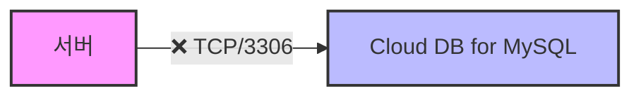

# 🖥️ 시스템 연결 및 데몬 관리 정리

## 📌 목차
1. [MySQL 연결 문제](#mysql-연결-문제)
2. [시스템 데몬](#시스템-데몬)
---

<div style="border: 2px solid #4CAF50; border-radius: 8px; padding: 20px; margin-bottom: 20px;">

## 🌐 섹션 1: MySQL 연결 문제 해결
### 🎯 현재 상태
- 서버와 Cloud DB for MySQL이 **동일 서브넷** 위치
- **TCP/3306** 포트로 접근 시도
- 연결 실패 발생



### 🔍 네트워크 구성
| 구성 요소 | 상태 |
|---------|------|
| 서브넷 | 동일 서브넷 ✅ |
| 포트 | TCP/3306 시도 중 |
| 연결 상태 | 실패 ❌ |

### ⚠️ 원인 및 해결
1. **ACG 설정 변경**
   ```
   Cloud DB for MySQL ACG
   ├── 서버 IP 추가
   └── TCP/3306 포트 허용
   ```

### ✅ 설정 체크리스트
- [ ] ACG 접근
- [ ] 서버 IP 등록
- [ ] 3306 포트 허용
- [ ] 연결 테스트
</div>

---

<div style="border: 2px solid #2196F3; border-radius: 8px; padding: 20px; margin-bottom: 20px;">

## 🤖 섹션 2: 시스템 데몬 관리
### 📊 주요 데몬 구성
| 데몬 | 포트 | 주요 기능 | 저장 위치 |
|-----|------|----------|-----------|
| syslogd | UDP/514 | 시스템 로그 수집/저장 | /var/log/messages |
| crond | - | 주기적 작업 실행 | /var/log/cron |
| sshd | TCP/22 | 원격 접속 관리 | /var/log/secure |
| httpd | TCP/80,443 | 웹 서버 | /var/log/httpd |
| ftpd | TCP/21 | 파일 전송 | /var/log/xferlog |

### 🧠 데몬(Daemon) 개념 및 핵심 기능
- **데몬(Daemon)**은 백그라운드에서 실행되는 프로그램으로, 시스템의 자동화된 작업을 처리
- 사용자가 직접적으로 실행하지 않아도 자동으로 실행되며, 시스템의 서비스나 기능을 지속적으로 제공

  ⚙️ 기능
    - 백그라운드 실행: 사용자 개입 없이 시스템에서 백그라운드로 자동으로 실행되어 필요한 작업 처리
    - 자동화: 주기적 작업 실행(crond), 로그 수집(syslogd), 원격 접속 관리(sshd) 등 다양한 작업을 자동으로 처리
    - 시스템 서비스 제공: 웹 서버(httpd), FTP 서버(ftpd), 데이터베이스 서버(ex:MySQL 데몬) 등 다양한 네트워크 서비스를 제공

### 🔍 syslogd 핵심 기능
- 시스템 로그 자동 수집
- 이벤트/에러 정보 기록
- 네트워크 로그 전송
- 중앙 집중식 로그 관리

### 💡 데몬 관리 명령어
```bash
# 상태 확인
systemctl status [데몬명]

# 시작/중지
systemctl start/stop [데몬명]

# 자동 시작 설정
systemctl enable [데몬명]
```
</div>

<div style="border: 2px solid #FF9800; border-radius: 8px; padding: 20px;">

## 📝 최종 정리
### 🎯 MySQL 연결
| 항목 | 이전 | 이후 |
|-----|------|------|
| ACG 설정 | ❌ 차단 | ✅ 허용 |
| 연결 상태 | ❌ 실패 | ✅ 성공 |
| 포트 접근 | ❌ 불가 | ✅ 가능 |

### 🤖 시스템 데몬
1. syslogd를 통한 중앙화된 로그 관리
2. 각 데몬별 전용 포트 및 로그 위치
3. systemctl로 통합 관리
</div>
